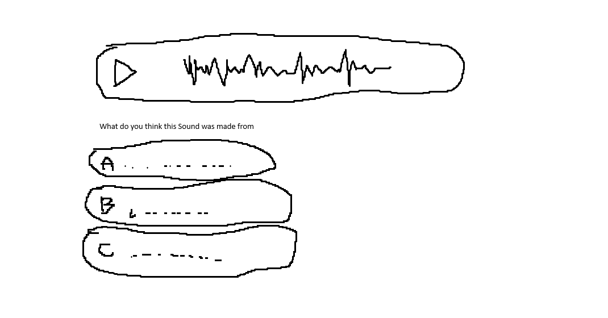
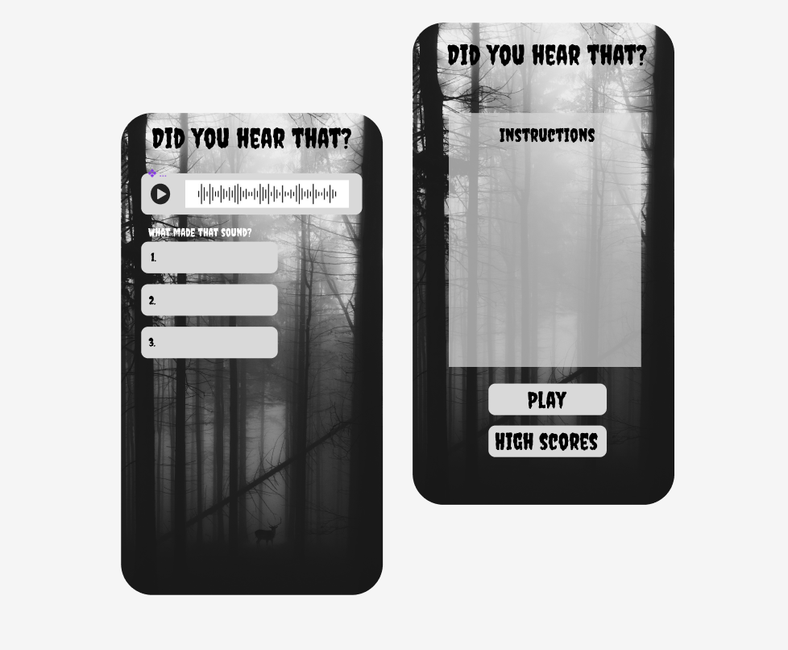

<h1 align="center"><strong>🎃🎃🎃 Phantom Forge: A Halloween Hackathon 🎃🎃🎃</strong>

</h1>

# DID YOU HEAR THAT? 
## by the GhoulGroovers 
 
### Deployment
The project is deployed and can be accessed at [Didyouhearthat](https://ktc96.github.io/Didyouhearthat/).

## ABOUT 
### Intro

This quiz tests the user's knowledge of Spooky Sounds from their favourite Halloween films. 

Listen to the audio and see if you know how the sound was made.

### Goal

- The goal of this project was to create an interactive Halloween themed quiz. 

- It provides a fun and challenging way for users to test how well they know the classic Halloween sound effects from their favourite spooky films.

- The target audience for this project is anyone who has seen a Halloween film.

- The quiz is an entertaining twist on the classic JavaScript quiz allowing the user to get into the Halloween spirit with its on theme styling and design.

### Collaborators 

- Scrum Master - Rachel Walmsley
- Kyle Clow
- Ulrike Riemenschneider
- Sarah Barter
- Natalia Czeladka
- Alexander Lungu

### User Stories

- Welcome Page - As a visiting user, I want to see the rules of the quiz and to be able to input my name. I then want be able to start the quiz. 

- Game Selection Section - As a visiting user, I want to be able to choose between Movies and Sounds. 

- Game Main Section - As a visting user, I want to be able to see the audio and connecting answers. I want to see my score recorded.

- End Section - As a visiting user, I want to see my final result after completing the quiz and have the option to take the quiz again.

- High Score Page - As a visiting user, I want to be to see my top three scores after playing the quiz.

- Creators Page - As a visting user, I want to be able to learn more about the creators of the app.

### Features

- Nav Bar - The title of the quiz is visible next to the app's logo. The title acts a link to the main page of the quiz. To the right there are links to the pages "Halloween Quiz" (the main quiz page), "High Score" (a page listing the user's high scores),and "Creators" (a page giving details on the app's creators). The same nav bar is displayed on every page of the app. On small screen devices the nav bar displays the app name and logo and a burger menu for the other page links.

- Quiz rules - The user will see the quiz rules on loading the app for the first time. 

- Username input - The user is invited to type in their name. This makes the app more personal and will be used at the end of the game and on the High Score page.

- Quiz Start Section - The quiz section displays the first question showing the title of the film, the audio file which the user clicks to listen to, and three answer options. The user will see the total number of questions in the quiz and what number question they are answering. The will also see their total correct and total incorrect answers.

- Quiz End Section - The user's final score is displayed. They then have the option to play again with the same name or to input a new name.

- High Score Page - 

- Creators Page - The names of all the contributing developers are displayed along with links to their GitHub profiles, LinkedIn profiles and other social media accounts.

- Footer - The copyright for the app is displayed. There is also a link to the app creators page. The same content is displayed on every page.

### Future Features

- A submit button under the three answer options that the user will click after making their answer selection. This will improve UX and adhere to defensive design principles.

#### Future Enhancements

- To be prevent the ghost that haunts the app from passing over the quiz game section and blocking the user's access to clicking play on the audio or clicking on any of the answer options.

### Design

#### Colour Scheme
The colour scheme of "Did you hear that?" Halloween Sounds Quiz was generated from its background picture. Because it plays a crucial role in setting the tone and atmosphere of the app, we all wanted to introduce colours commonly associated with Halloween, such as black, grey, and orange. Keeping the page simple and clear was our highest priority, so choosing the classic combination of black and white was a pretty obvious choice here. A few subtle shades of grey and blue emphasize the dark night design, but the cherry on the cake and the strongest colour accent of the website is a mid-toned, golden ochre shade called buff, our subdued equivalent of flashy orange.

We used [Coolors](https://coolors.co/777777-d39b5b-ffffff-557596-1c234e-000000) to generate our colour palette.

#### Typography 
To emphasize the contrast between different level headings, we have carefully selected two different fonts. They are both Google Fonts, but that's where the similarities end. The fonts were paired to enhance the visual hierarchy of the website and highlight essential information.

- The [Crimson Text](https://fonts.google.com/specimen/Crimson+Text?query=crimson+) font is the primary font used throughout the entire website, with Serif as the fallback font. It's a clean and legible font that ensures easy readability. We mainly used it to provide text content for paragraphs, quiz answers, and short notes (e.g. in the footer).

- The [Creepster](https://fonts.google.com/specimen/Creepster?query=creepster) font was used for almost all of the main headings and the logo. It's a bold and eye-catching font that easily draws attention, also a perfect match for our Halloween theme with its spooky curves and horror-related design.

- [Font Awesome](https://fontawesome.com/) icons were used for social media links and spider-shaped bullet points.

### Wireframes

### Technologies Used

#### Languages Used

- [HTML](https://en.wikipedia.org/wiki/HTML) - used for the main site content.
- [CSS](https://en.wikipedia.org/wiki/CSS) - used for the main site design and layout.
- [JavaScript](https://www.javascript.com) - used for user interaction on the site.

#### Frameworks, Libraries and Programs Used

- [Am I responsive?](https://ui.dev/amiresponsive) - used to check the site's responsiveness and to create mockups.
- [Bootstrap v5.3](https://getbootstrap.com/) - used to assist with responsiveness by utilizing its components and layout elements.
- [Coolors](https://coolors.co/) - used to create the colour palette.
- [Font Awesome](https://fontawesome.com/) - used to provide icons across the website.
- [Free Convert](https://www.freeconvert.com/jpg-to-webp) - used to convert jpg/png images to webp format.
- [Google Chrome Dev Tools](https://developer.chrome.com/docs/devtools/) - used to inspect and debug the code.
- [Google Fonts](https://fonts.google.com/) - used to import the fonts that style all of the text content.
- [Git](https://git-scm.com/) - used for version control by utilizing VS Code's terminal.
- [GitHub](https://github.com/) - used to store the project's code and images in the repository.
- [GitHub Pages](https://pages.github.com/) - used to deploy the website.
- [Icon-Icons](https://icon-icons.com/) - used to provide the favicon.
- [Tiny.png](https://tinypng.com/) - used to reduce the size of the image files.
- [Visual Studio Code](https://code.visualstudio.com/) - used as a code editor.

### Testing

Please follow this [link](TESTING.md) to the separate Testing documentation. 

### Test Cases

### Depolyment

#### GitHub pages for deployment

The steps taken to deploy the project:
1. Naviagate to Settings on the GitHub repo page.
2. Click on Pages.
3. Click deploy from branch.

#### To clone the repo:

1. On GitHub click on the green <> Code button,
2. In the dropdown menu select Local and copy the url for the repository.
3. Create a file on your desktop and right click to open with code, i.e. your local environment.
4. On the welcome page select the option Clone Git Repo and paste the URL.
5. Save it to the folder you created on your desktop.

### Credits

- For the jumpscares and the ghost that haunts the app - https://github.com/alienmelon/JUMP_SCARES_FOR_YOUR_WEBSITE
- Images open sourced from - https://www.shutterstock.com/, https://www.unsplash.com/
- Audio files open sourced from - 

#### Code from the team's projects

The team combined code from personal quiz projects: 
- https://github.com/KTC96/TheGreenDragonPubQuiz/blob/main/assets/JS/script.js 
- https://github.com/URiem/geography-game/blob/main/assets/js/script.js 
- https://github.com/barty-s/art-quiz-app/blob/main/assets/js/script.js

